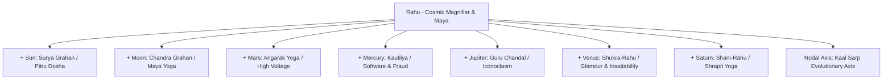

# 📹 Comprehensive Audit of Unsynced Local Media, Video Lectures & Astrological Assets

> **Repository:** `d:\newWayToAstro` (`knight0917/astroweb`)  
> **Source Directory:** `D:\ASTROLOGY-BOOKS-DATABASE-master\Unsynced-Local-Files` (941 Files, ~3.2 GB)  
> **Scope:** Granular audit of the downloaded video lecture, classical texts, advanced KP/Cuspal Interlinks books, multi-volume Vāstu treatises, and 761 empirical chart databases (.cht / .jhd).

---

## 📊 Executive Inventory of `Unsynced-Local-Files`

| Sub-Folder / Asset Group | File Count | Total Size | Primary Content |
|---|---|---|---|
| **1. Video Lecture (`Root\`)** | 1 File | **1.25 GB** | 1080p Masterclass: *Rahu Conjunctions & Results* by Acharya Vishnukripa (`X78Ggu9ASe8`). |
| **2. Unsynced Books (`Books\`)** | 111 Files | **210 MB** | V.P. Goel Navamsha, S.P. Khullar & Baskaran Cuspal Interlinks, KP Readers 1–6, B.V. Raman memoirs & 300 Yogas, Brahmasutra. |
| **3. C.S. Patel Masterwork (Top-Level)** | 1 File | **24.3 MB** | *Ashtakavarga (1957 First Edition)* by C.S. Patel & K.S. Aiyar (The bible of Ashtakavarga transit math). |
| **4. Advanced Texts (`Root\`)** | 8 Files | **450 MB** | *Jaimini KVA* (227 MB), *Prasna Tantra* (B.V. Raman & Subramanyam), *Predict with Navamsha* (V.P. Goel), *Margabandhu*. |
| **5. Classical Vāstu Śāstra (`vastu sastra\`)** | 4 Files | **798 MB** | Multi-volume encyclopedias: *Vastu-Sastra Vol II*, *Smruti-Tattva*, *Vastu-Sastra*, and *6800.pdf* (Mayamata & Samarāngana Sūtradhāra). |
| **6. Kala Software Database (`Charts Kala\`)** | 697 Files | **2.8 MB** | Complete `.cht` chart library from Ernst Wilhelm's Kala Software (Military, Sovereigns, Actors, Scientists, Tragedies). |
| **7. JHora Software Database (`Database jhora\`)** | 64 Files | **250 KB** | Verified `.jhd` chart files from P.V.R. Narasimha Rao (Ramakrishna, Vivekananda, Aurobindo, B.V. Raman, B.S. Rao). |
| **8. Research Suite (`AnkitAstro\`)** | 55 Files | **8.5 MB** | 30 client `.jhd` horoscopes, 28 Nakshatra guides, Dagdha Rashi maps, Ashtakavarga score cheat-sheets, Numerology. |

---

## 🎥 1. In-Depth Video Masterclass Analysis: Rahu Conjunctions & Results

*   **File:** `D:\ASTROLOGY-BOOKS-DATABASE-master\Unsynced-Local-Files\Root\YTDown_YouTube_Rahu-Vishnukripa-Conjuctions-and-Result-_Media_X78Ggu9ASe8_001_1080p.mp4`
*   **Instructor:** Acharya Vishnukripa (Vishnu Kripa Astrology)
*   **Video Format:** 1080p Full HD • 1.25 GB
*   **Core Astrological Thesis:**  
    Rahu is not merely a malefic shadow (*Chhaya Graha*); it acts as the **Cosmic Magnifier, Karmic Obsession Engine, and Maya Matrix**. Wherever Rahu conjoins another planet, it amplifies that planet's significations (*Karakatwas*) to an extreme, insatiable degree, while simultaneously injecting illusion, unconventional behavior, and foreign elements.

### Detailed Planetary Conjunction Matrix from the Video

#### A. Rahu + Sun (Surya-Rahu Grahan / Pitru Dosha)
*   **Psychological Impact:** Identity crisis, conflicting ego dynamics, extreme struggle between desiring royal public recognition and feeling unrecognized or alienated.
*   **Life Events:** Friction or early separation from father; sudden elevation in political or corporate rank followed by dramatic reputational vulnerabilities; eyesight or cardiovascular weaknesses.
*   **Shastric Remedy:** Daily Surya Arghya in copper vessel with red sandalwood, Aditya Hridaya Stotra, donating wheat and copper utensils on Sundays.

#### B. Rahu + Moon (Chandra-Rahu Grahan / Maya Yoga)
*   **Psychological Impact:** Hyper-reactive emotional nervous system, subconscious phobias, deep psychic intuition, vivid dreams, tendencies toward anxiety, depression, or emotional paranoia.
*   **Life Events:** Health struggles for mother; emotional misunderstandings with maternal figures; exceptional talent for photography, cinema, fantasy writing, and psychological profiling.
*   **Shastric Remedy:** Worship of Lord Shiva with milk Abhishek on Mondays; wearing pure silver ring/chain; avoiding dark, stagnant rooms; practicing Trataka meditation.

#### C. Rahu + Mars (Angarak Yoga / High-Voltage Dynamic)
*   **Psychological Impact:** Fierce inner urgency, explosive temper, impatience with bureaucracy, fearless defiance of danger, competitive drive that stops at nothing.
*   **Life Events:** Surgical interventions, accident-proneness (especially fire, electricity, or vehicles), exceptional capability in defense, surgery, mechanical engineering, real estate development, or high-risk trading.
*   **Shastric Remedy:** Chanting Hanuman Chalisa 7 times daily; voluntary blood donation; maintaining strict athletic or yogic discipline; donating red lentils (*masoor dal*) to laborers.

#### D. Rahu + Mercury (Budha-Rahu / Kautilya / Maya-Buddhi Yoga)
*   **Psychological Impact:** Supercharged intellectual processing, lateral out-of-the-box thinking, mastery of codes, algorithms, sarcasm, and persuasion.
*   **Life Events:** Prodigious coding, software architecture, data analysis, foreign trade, marketing, and diplomatic negotiation; potential for nervous exhaustion, speech restlessness, or susceptibility to online scams/fraud.
*   **Shastric Remedy:** Reciting Vishnu Sahasranama; watering sacred Tulsi plant; feeding green fodder to cows on Wednesdays; practicing mindful silence (*Mouna*).

#### E. Rahu + Jupiter (Guru-Chandal Yoga / Iconoclastic Seeker)
*   **Psychological Impact:** Skepticism toward dogmatic rituals; questions traditional authority; seeks esoteric, universal, or borderless spiritual truths.
*   **Life Events:** Initial disputes with mentors, preceptors, or paternal figures; potential legal or ideological controversies in early life; becomes an influential reformist, philosopher, or international educator in maturity.
*   **Shastric Remedy:** Honoring true spiritual masters; reciting Brihaspati Stotra; donating yellow turmeric, saffron, and gold/brass vessels; feeding yellow sweets or chana dal to cows.

#### F. Rahu + Venus (Shukra-Rahu / Glamour & Luxury Obsession)
*   **Psychological Impact:** Insatiable appetite for aesthetic beauty, luxury, sensory indulgence, fashion, media, and romantic fascination.
*   **Life Events:** Unconventional, inter-cultural, or inter-religious partnerships; magnetic public charm; immense success in show business, media, luxury brands, and arts; vulnerabilities to romantic disillusionment, scandal, or endocrine/reproductive health issues.
*   **Shastric Remedy:** Worship of Goddess Durga or Mahalakshmi; Friday fasts (*Shukra Vrata*); maintaining strict marital ethics and mutual respect; donating white silk garments, camphor, and curd.

#### G. Rahu + Saturn (Shani-Rahu / Shrapit Yoga / Ancient Karmic Lock)
*   **Psychological Impact:** Deep melancholy, stoic endurance, feeling burdened by inexplicable ancestral obligations, extreme perseverance under adversity.
*   **Life Events:** Heavy delays before age 36; career stability achieved through sheer grind; mastery over mining, oil, geology, deep tech, and heavy machinery; chronic arthritis, dental, or neuromuscular sensitivities.
*   **Shastric Remedy:** Regular recitation of the Mahamrityunjaya Mantra; Saturday evening mustard oil lamp under a sacred Peepal tree; selfless service to the disabled, destitute, and elderly.

---

## 📚 2. Unsynced Classical Texts & Advanced Modern Astrological Books

### A. V.P. Goel's *Predict with Navamsha* (`Root\jyotish-2017-vp-goel...pdf`)
*   **Status:** 🔴 **Unimplemented in Engine** (Only basic D9 chart exists).
*   **Critical Unincluded Techniques:**
    1.  **Navamsha Tulya Rashi & Rashi Tulya Navamsha Overlays:** Projecting D-9 planets onto D-1 houses to diagnose subtle karmic fruition.
    2.  **64th Navamsha (Khara Navamsha):** The exact degree 210° from Moon/Ascendant; transits of Saturn and Rahu over the 64th Navamsha lord produce critical health and career turning points.
    3.  **Pushkara Navamsha & Pushkara Bhaga:** Exact auspicious degrees in Navamsha that revitalize even debilitated planets into sovereign benefics.
    4.  **Bhava Lords Placed in Navamsha:** Nuanced predictions for 1st through 12th lords placed in each Navamsha sign.

### B. C.S. Patel & K.S. Aiyar's *Ashtakavarga (1957 First Edition)* (`Top-Level`)
*   **Status:** 🟡 **Partially Implemented** (Basic bindus & Shodhana implemented; Patel's transit timing missing).
*   **Critical Unincluded Techniques:**
    1.  **Kakshya Division (3°45' Sub-Slices):** Dividing each zodiac sign into 8 Kakshyas ruled by Saturn, Jupiter, Mars, Sun, Venus, Mercury, Moon, Lagna. When a planet transits a Kakshya containing a bindu contributed by its lord, favorable events occur with clockwork precision.
    2.  **Samudaya Ashtakavarga (SAV) 337 Bindus Equilibrium:** Precise thresholds (signs with >28 bindus yield wealth and health; signs with <25 bindus cause strain and drainage).
    3.  **Rasi Pinda & Graha Pinda Multiplications:** Exact mathematical timing of marriage, birth of children, and critical lifespan events via Saturn/Jupiter transits over Pinda degrees.

### C. Krishnamurti Padhdhati (KP System) & Cuspal Interlinks (KCIL)
*   **Files:** *Kalamsa and Cuspal Interlinks* by S.P. Khullar, *Applications of Cuspal Interlinks* by Baskaran, *KP Readers 3, 4, 6* by K.S. Krishnamurti (`Books\`).
*   **Status:** 🟡 **Partially Implemented** (`cuspalInterlinks.ts` has preliminary sub-sub math; full 249 table and multi-house interlinkage missing).
*   **Critical Unincluded Techniques:**
    1.  **Full 249 Sub-Lord & Sub-Sub-Lord Division Matrix:** Exact Placidus cuspal subdivisions down to arcseconds.
    2.  **Cuspal Interlinks (KCIL):** House Cuspal Sub-Lord (CSL) establishing linkages between primary houses (e.g. 7th CSL linked to 2, 7, 11 promises marriage; linked to 1, 6, 10 denies marriage).
    3.  **Ruling Planets (RP) for Instant Verification:** Ascendant Sign Lord, Ascendant Star Lord, Moon Sign Lord, Moon Star Lord, and Day Lord computed at the exact moment of astrological inquiry.

### D. Classical Vāstu Śāstra Library (4 Volumes, ~800 MB)
*   **Files:** *Vastu-Sastra Vol II (Hindu Science of Architecture)*, *Smruti-Tattva*, *Vastu-Sastra*, and *6800.pdf* (`vastu sastra\`).
*   **Status:** 🟡 **Partially Implemented** (81-grid Mandala exists in `vastuEngine.ts`; structural geometry & soil tests missing).
*   **Critical Unincluded Techniques:**
    1.  **Bhumi Pariksha (Soil Testing & Energy Quality):** Trench water absorption test, seed germination velocity, soil color, odor, and magnetic resonance.
    2.  **Plavanam (Topographical Slope):** Auspicious downward slopes toward North and East (*Ishanya Plavanam*), elevated South and West (*Nairritya Unnatam*).
    3.  **Vastu Purusha Shodasha Anga (16 Sensitive Marmas):** Exact vital energy lines (*Nadis*) that must never be punctured by pillars, staircase columns, or underground septic tanks.

---

## 💾 3. Empirical Chart Databases: Kala (697 Charts) & JHora (64 Charts)

### A. Kala Software Database (`Charts Kala\`) — 697 `.cht` Files
*   **Format:** Proprietary binary/text chart files from Ernst Wilhelm's Kala Software.
*   **Categories:**
    *   **Military:** Field Marshal Erwin Rommel, General Douglas MacArthur, George Patton, Admiral Nimitz.
    *   **Sovereigns & Heads of State:** Winston Churchill, John F. Kennedy, Abraham Lincoln, Queen Elizabeth II, Charles de Gaulle.
    *   **Artists & Performers:** Gene Kelly, Marlon Brando, Marilyn Monroe, Elvis Presley, Charlie Chaplin.
    *   **Scientists & Philosophers:** Albert Einstein, Isaac Newton, Carl Jung, Sigmund Freud, Nikola Tesla.
    *   **Tragic & Medical Cases:** Victims of plane crashes, sudden terminal illness, criminal forensics.
*   **Implementation Opportunity:** Can be parsed into a automated benchmark validation dataset to empirically test yoga triggers, dasha timing, and maraka periods against known historical lifespans.

### B. Jagannatha Hora Database (`Database jhora\`) — 64 `.jhd` Files
*   **Format:** Standard JHora chart format by P.V.R. Narasimha Rao.
*   **High-Value Charts:**
    *   *Sri Ramakrishna Paramahansa* (Aquarius Lagna, exalted 5 planets)
    *   *Swami Vivekananda* (Sagittarius Lagna, Moon in 10th with Saturn)
    *   *Dr. B.V. Raman* (Aquarius Lagna, celebrated master astrologer)
    *   *Prof. B. Suryanarain Rao* (Doyen of Vedic astrology revival)
    *   *Sri Aurobindo* (Cancer Lagna, exalted Jupiter in Lagna)
*   **Implementation Opportunity:** Ready to be converted into JSON test fixtures in `src/engine/benchmarkHoroscopes.ts`.

---

## 🗺️ 4. Master Architectural Gap Matrix: What to Add Next

| Asset / Source | Astrological Subject | Current Codebase Status | Engineering Priority | Proposed Engine Target |
|---|---|---|---|---|
| **Vishnukripa Video** | Rahu Conjunctions (7 Planets) & Psychological/Karmic Results | 🟡 Implicit in Yogas | **High** | `src/engine/rahuConjunctionsMaster.ts` |
| **V.P. Goel Book** | 64th Navamsha, Pushkara Bhaga & Navamsha Tulya Rashi | 🟡 Basic flags in Parijata | **High** | `src/engine/pushkaraNavamsha.ts` upgrade |
| **C.S. Patel 1957** | 8 Kakshya Divisions (3°45') & Pinda-Based Transit Timing | 🟡 Basic Ashtakavarga | **Medium-High** | `src/engine/patelAshtakavarga.ts` upgrade |
| **S.P. Khullar / KP** | Full 249 Sub-Sub Lord Tables & Cuspal Linkage Matrices | 🟡 Preliminary KCIL | **Medium** | `src/engine/cuspalInterlinks.ts` expansion |
| **JHora & Kala DBs** | 761 Verified Historical & Benchmark Horoscopes | 🟡 21 Hardcoded Charts | **Medium** | `src/engine/benchmarkHoroscopes.ts` expansion |
| **Vāstu Śāstra Corpus** | Marmas, Topographical Slope (*Plavanam*), Soil Tests | 🟡 81-Grid Purusha | **Medium** | `src/engine/vastuEngine.ts` upgrade |
